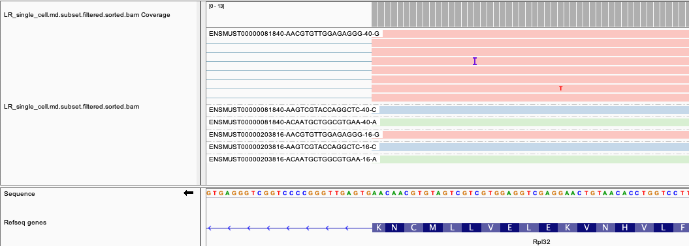
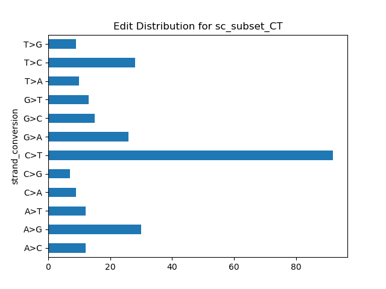
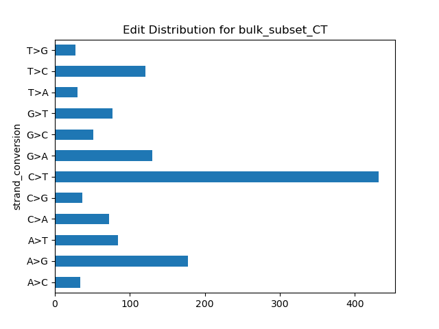
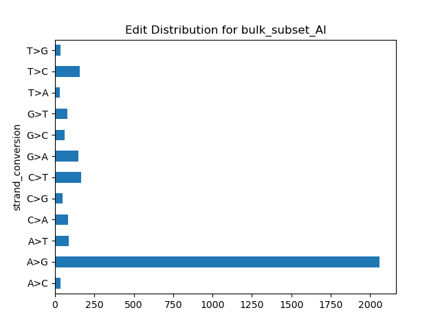

# MARINE: 
Multi-core Algorithm for Rapid Identification of Nucleotide Edits
------------------------------------------------------
MARINE relies on the MD tag being present in your .bam file. Some tools like STAR provide the option to add the MD tag during alignment, but otherwise you may have to add it after alignment. To add the MD tag and then index the processed bam, use the following samtools command templates:

```
samtools calmd -bAr input.bam reference_genome.fa > input.md.bam
samtools index input.md.bam
```

MARINE was developed and tested using Python 3.8.18 and is not guaranteed to work with earlier versions of Python.
Use the provided .yml file to create a new conda environment that contains all required dependencies, including the proper Python version, for MARINE:

```
conda env create  --file=marine_environment2.yaml
conda activate marine_environment
```

or if you encounter problems with this approach, try using mamba instead, which can be faster:

```
mamba create -n marine_environment python=3.8.18 -y
mamba env update -n marine_environment --file marine_environment2.yaml
conda activate marine_environment
```

Notes:
* The more cores used, the faster MARINE will run
* Ensure that your annotation bedfile has the same chromosome nomenclature (e.g., "9" vs "chr9") as your bam
* The annotation bedfile should be tab-separated and should have a standard bed6 column ordering, as follows:
```
1       29554   31109   MIR1302-2HG     lincRNA  +       
1       34554   36081   FAM138A         lincRNA  -       
1       65419   71585   OR4F5           protein_coding  +       
1       89295   133723  AL627309.1      lincRNA  -       
1       89551   91105   AL627309.3      lincRNA  -       
```

### Installation
Simply git clone this repository using the link at the top right on the main repository page. Should take at most a minute or two.

### Command parameters
```
usage: marine.py [-h] [--bam_filepath BAM_FILEPATH] [--annotation_bedfile_path ANNOTATION_BEDFILE_PATH] [--output_folder OUTPUT_FOLDER] [--barcode_whitelist_file BARCODE_WHITELIST_FILE]
                 [--cores CORES] [--strandedness STRANDEDNESS] [--coverage] [--filtering] [--annotation] [--barcode_tag BARCODE_TAG] [--min_dist_from_end MIN_DIST_FROM_END]
                 [--min_base_quality MIN_BASE_QUALITY] [--contigs CONTIGS] [--min_read_quality MIN_READ_QUALITY] [--sailor] [--verbose] [--paired_end] [--skip_coverage]
                 [--max_edits_per_read MAX_EDITS_PER_READ] [--num_intervals_per_contig NUM_INTERVALS_PER_CONTIG]

Run MARINE

optional arguments:
  -h, --help            show this help message and exit
  --bam_filepath BAM_FILEPATH
  --annotation_bedfile_path ANNOTATION_BEDFILE_PATH
  --output_folder OUTPUT_FOLDER
                        Directory in which all results will be generated, will be created if it does not exist
  --barcode_whitelist_file BARCODE_WHITELIST_FILE
                        List of cell barcodes to use for single-cell analysis
  --cores CORES
  --strandedness STRANDEDNESS
                        If flag is used, then assume read 2 maps to the sense strand (and read 1 to antisense), otherwise assume read 1 maps to the sense strand
  --coverage
  --filtering
  --annotation
  --barcode_tag BARCODE_TAG
                        CB for typical 10X experiment. For long-read and single-cell long read analyses, manually add an IS tag for isoform or an IB tag for barcode+isoform information.
                        Leave blank for bulk seqencing
  --min_dist_from_end MIN_DIST_FROM_END
                        Minimum distance from the end of a read an edit has to be in order to be counted
  --min_base_quality MIN_BASE_QUALITY
                        Minimum base quality, default is 15
  --contigs CONTIGS
  --min_read_quality MIN_READ_QUALITY
                        Minimum read quality, default is 0... every aligner assigns mapq scores differently, so double-check the range of qualities in your sample before setting this
                        filter
  --sailor
  --verbose
  --paired_end          Assess coverage taking without double-counting paired end overlapping regions... slower but more accurate. Edits by default are only counted once for an entire
                        pair, whether they show up on both ends or not.
  --skip_coverage
  --max_edits_per_read MAX_EDITS_PER_READ
  --num_intervals_per_contig NUM_INTERVALS_PER_CONTIG
                        Intervals to split analysis into... more intervals can yield faster perforamance especially with multiple cores
```

# Example commands below are drawn from files in the "examples" folder

The examples should take no more than a few minutes to run, especially if multiple CPUs are avilable for use (and specified using the --cores arugment). MARINE was developed and tested in Linux running on x86_64 but should work without any special hardware. Please let us know if you encounter any problems by creating a GitHub issue in this repository.

Expected example outputs are contained in the subfolders in the examples folder.

## Single-cell example MARINE command
MARINE will calculate edits and coverage on a per-cell basis. For example, the G at position 3000525 occurs in a region in the cell with the barcode ending in CGG-1, which only has 4 reads at that location. Meanwhile, the T at this position occurs instead in the cell with barcode ending in CAC-1 with 12 reads. These cell-specific edit counts and coverages will be reflected in MARINE outputs. Strandedness for 10X inputs should be 2.


```
python marine.py \
--bam_filepath examples/data/single_cell_CT.md.subset.bam \
--output_folder examples/sc_subset_CT \
--barcode_whitelist_file examples/data/sc_barcodes.tsv.gz \
--barcode_tag "CB" \
--num_intervals_per_contig 16 \
--strandedness 2
```

## Single-cell long read (PacBio) example MARINE command
MARINE can be used to calculate edits and coverage on a per-cell and per-isoform basis after certain pre-processing steps are taken. Reads can be quantified and assigned to annotated isoforms using IsoQuant (v3.3.0) with parameters: --data-type pacbio, --transcript_quantification unique_only, and --gene_quantification unique_only. The read assignment output from IsoQuant can be used to add an isoform tag for each read, indicating the isoform to which it was assigned. Furthermore, the cell barcode can be concatenated to the isoform in a new tag called "IB", as shown in the IGV screenshot below (grouping labels refer to this tag in this case). Note that a suffix has been added to each IB tag reflecting the ending of both the isoform ID and the cell barcodes, which is used for efficiently calculating coverage only within each appropriate subset of isoform and cell-specific reads.



```
python marine.py \
--bam_filepath examples/data/LR_single_cell.md.subset.filtered.sorted.bam \
--output_folder examples/sc_lr_subset_CT \
--barcode_whitelist_file examples/data/sc_lr_barcodes.tsv.gz \
--barcode_tag "IB" \
--num_intervals_per_contig 16
--strandedness 2
```

This is derived from an APOBEC1-fusion experiment, so we expect an enrichment for C>T (C>U) edits.




## Bulk example MARINE command

```
python marine.py \
--bam_filepath examples/data/bulk_CT.md.subset.bam \
--output_folder examples/bulk_subset_CT \
--reverse_stranded \
--cores 16 \
--annotation_bedfile_path /annotations/hg38_gencode.v35.annotation.genes.bed \
--strandedness 2
--contigs "chr1"
```

This is derived from an APOBEC1-fusion experiment, so we should also expect to see an enrichment for C>T (C>U) edits:




Likewise, using bulk_subset_AI.md.subset.bam, which derives from an experiment using an A to I editor, we
should expect to see to see an enrichment for A>G (I is interpreted as a G) edits:





## Bulk (paired-end) example MARINE command -- example not provided 
```
python marine.py \
--bam_filepath examples/data/bulk_CT.md.subset.bam \
--output_folder examples/bulk_subset_CT \
--cores 16 \
--annotation_bedfile_path /annotations/hg38_gencode.v35.annotation.genes.bed \
--contigs "chr1" \
--strandedness 2 \
--paired_end
```
