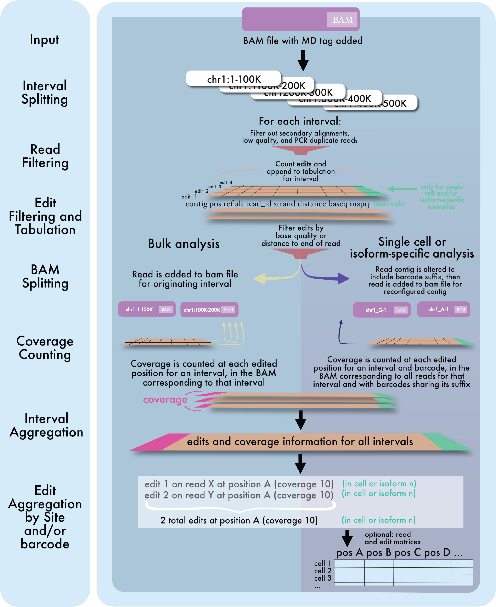
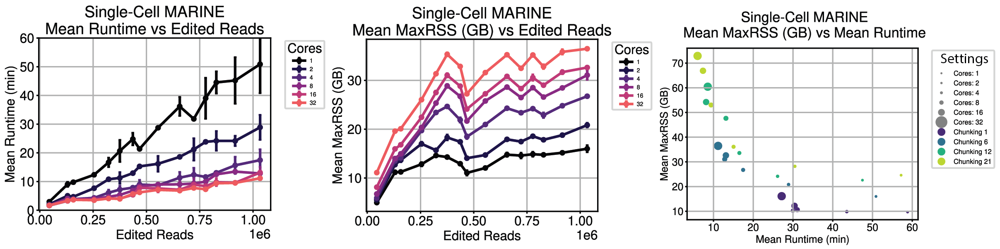
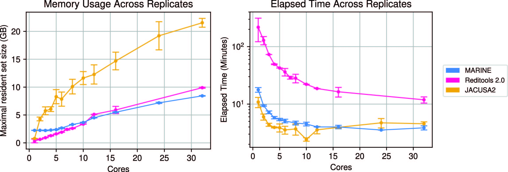

------------------------------------------------------
# Table of Contents
- [Introduction](#introduction)
- [System Requirements](#system-requirements)
- [Installation](#installation)
- [Notes](#notes)
- [Command Parameters](#command-parameters)
- [Examples](#examples)
  - [Single-Cell Example](#single-cell-example)
  - [Single-Cell Long Read Example](#single-cell-long-read-example)
  - [Bulk Example](#bulk-example)
  - [Bulk Paired-End Example](#bulk-paired-end-example)
 
# Introduction 

RNA editing is a widespread phenomenon that drives transcriptomic diversity and influences cellular differentiation and function. Despite its importance, existing tools are inefficient for comprehensive analysis of RNA editing in single-cell datasets. We introduce MARINE (Multi-Core Algorithm for Rapid Identification of Nucleotide Edits), a powerful and efficient tool for mapping the RNA editing landscape at single-cell resolution.

Overview:


Speed and memory profiles:


Comparison to existing tools for bulk RNA-seq data:


# System Requirements 

## Hardware requirements

MARINE requires only a standard computer with enough RAM to support the in-memory operations.

## Software requirements

OS Requirements

This package is supported for macOS and Linux. The package has been tested on the following systems:

Linux: Ubuntu 16.04

## Python Dependencies

MARINE uses Python >= 3.10, and all required dependencies can be installed using the conda or mamba commands described below.

# Installation
Simply git clone this repository using the link at the top right on the main repository page. Should take at most a minute or two.

```
git clone https://github.com/YeoLab/MARINE.git
```

MARINE was developed and tested using Python 3.8.18 and is not guaranteed to work with earlier versions of Python.
Use the provided .yml file to create a new conda environment that contains all required dependencies, including the proper Python version, for MARINE:

```
conda env create  --file=marine_environment2.yaml
conda activate marine_environment
```

or if you encounter problems with this approach, try using mamba instead, which can be faster:

```
conda install -c conda-forge mamba=1.5.12 -y
mamba create -n marine_environment python=3.10 -y
mamba env update -n marine_environment --file marine_environment2.yaml
conda activate marine_environment
```

# Notes:

* MARINE relies on the MD tag being present in your .bam file. Some tools like STAR provide the option to add the MD tag during alignment, but otherwise you may have to add it after alignment. To add the MD tag and then index the processed bam, use the following samtools command templates:
```
samtools calmd -bAr input.bam reference_genome.fa > input.md.bam
samtools index input.md.bam
```
* The more cores used, the faster MARINE will run, up to a point
* Ensure that your annotation bedfile has the same chromosome nomenclature (e.g., "9" vs "chr9") as your bam
* The annotation bedfile should be tab-separated and should have a standard bed6 column ordering, as follows:
```
1       29554   31109   MIR1302-2HG     lincRNA  +       
1       34554   36081   FAM138A         lincRNA  -       
1       65419   71585   OR4F5           protein_coding  +       
1       89295   133723  AL627309.1      lincRNA  -       
1       89551   91105   AL627309.3      lincRNA  -       
```

### Command parameters
```
usage: marine.py [-h] [--bam_filepath BAM_FILEPATH] [--annotation_bedfile_path ANNOTATION_BEDFILE_PATH]
                 [--output_folder OUTPUT_FOLDER] [--barcode_whitelist_file BARCODE_WHITELIST_FILE] [--cores CORES]
                 [--strandedness {0,1,2}] [--barcode_tag BARCODE_TAG] [--min_dist_from_end MIN_DIST_FROM_END]
                 [--min_base_quality MIN_BASE_QUALITY] [--contigs CONTIGS] [--min_read_quality MIN_READ_QUALITY]
                 [--sailor [SAILOR]] [--bedgraphs [BEDGRAPHS]] [--verbose] [--keep_intermediate_files]
                 [--num_per_sublist NUM_PER_SUBLIST] [--paired_end] [--all_cells_coverage]
                 [--tabulation_bed TABULATION_BED] [--interval_length INTERVAL_LENGTH]

Run MARINE

optional arguments:
  -h, --help            show this help message and exit
  --bam_filepath BAM_FILEPATH
                        Full path to MD-tagged and indexed .bam file
  --annotation_bedfile_path ANNOTATION_BEDFILE_PATH
                        Full path to bed file with desired annotations in bed6 format (contig start end label1
                        label2 strand)
  --output_folder OUTPUT_FOLDER
                        Directory in which all results will be generated, will be created if it does not exist
  --barcode_whitelist_file BARCODE_WHITELIST_FILE
                        List of cell barcodes to use for single-cell analysis
  --cores CORES         Number of CPUs to use for analysis. Will default to using all cores available if not
                        specified
  --strandedness {0,1,2}
                        Possible values include: 0 (unstranded), 1 (stranded) and 2 (reversely stranded).
  --barcode_tag BARCODE_TAG
                        CB for typical 10X experiment. For long-read and single-cell long read analyses, manually
                        add an IS tag for isoform or an IB tag for barcode+isoform information. Do not provide any
                        arguments when processing bulk seqencing
  --min_dist_from_end MIN_DIST_FROM_END
                        Minimum distance from the end of a read an edit has to be in order to be counted
  --min_base_quality MIN_BASE_QUALITY
                        Minimum base quality, default is 0
  --contigs CONTIGS     Which contigs to process, in comma separated list (ie 1,2,3 or chr1,chr2,chr3, whichever
                        matches your nomenclature)
  --min_read_quality MIN_READ_QUALITY
                        Minimum read quality, default is 0... every aligner assigns mapq scores differently, so
                        double-check the range of qualities in your sample before setting this filter
  --sailor [SAILOR]     Generate SAILOR-style outputs.
  --bedgraphs [BEDGRAPHS]
                        Conversions for which to output a bedgraph for non-single cell runs, (e.g. CT,AI)
  --verbose
  --keep_intermediate_files
                        Keep intermediate files for debugging or to use --all_cells_coverage flag
  --num_per_sublist NUM_PER_SUBLIST
                        For single-cell datasets, specifies 'chunking', ie how many contigs to process at once. This
                        can be lowered to enable lower-memory runs, with the tradeoff of longer runtime
  --paired_end          Assess coverage taking without double-counting paired end overlapping regions... slower but
                        more accurate. Edits by default are only counted once for an entire pair, whether they show
                        up on both ends or not.
  --all_cells_coverage  Requires --keep_intermediate_files flag to be set. Caution: this can take a long time if too
                        many sites are used (think thousands of sites x thousands of cells... it gets big quickly),
                        it is worth reducing the number of sites to tabulate through filtering beforehand, and using
                        the additional argument --tabulation_bed to specify these sites.
  --tabulation_bed TABULATION_BED
                        Locations to run tabulation across all cells. The fist column should be contig, the second
                        should match the position in the final_filtered_sites_info.tsv file.
  --interval_length INTERVAL_LENGTH
                        Length of intervals to split analysis into... you probably don't have to change this.
```

# Examples
# Example commands below are drawn from files in the "examples" folder

The examples should take no more than a few minutes to run, especially if multiple CPUs are avilable for use (and specified using the --cores arugment). MARINE was developed and tested in Linux running on x86_64 but should work without any special hardware. Please let us know if you encounter any problems by creating a GitHub issue in this repository.

Expected example outputs are contained in the subfolders in the examples folder.

# Single cell example

MARINE will calculate edits and coverage on a per-cell basis. For example, the G at position 3000525 occurs in a region in the cell with the barcode ending in CGG-1, which only has 4 reads at that location. Meanwhile, the T at this position occurs instead in the cell with barcode ending in CAC-1 with 12 reads. These cell-specific edit counts and coverages will be reflected in MARINE outputs. Strandedness for 10X inputs should be 2.

* Note: The --all_cells_coverage flag can be used if you wish to generate .h5ad-formatted adata objects containing sparse matrices of barcodes x positions, for both read and edit counts at each edited position in each cell. However, as this involves counting coverage at every site within every cell, and since raw edited site counts can be quite high, it is not recommended to use this flag without an accompanying list of sites for which these adata objects should be generated. 

* Note: MARINE by default will filter out UMI duplicates based on the xf:i:25 tag at explained here: https://www.10xgenomics.com/analysis-guides/tutorial-navigating-10x-barcoded-bam-files


### Tabulating coverage and edits and only a selected set of positions
The code below will find all edited sites, and then generate h5ad adata-formatted objects containing all edit and read counts at all edited sites across all cells. Run on 32 cores, it takes about 6 minutes to complete.
```
python marine.py \
--bam_filepath examples/data/single_cell_CT.md.subset.bam \
--output_folder examples/sc_subset_CT \
--barcode_whitelist_file examples/data/sc_barcodes.tsv.gz \
--barcode_tag "CB" \
--strandedness 2 \
--all_cells_coverage # This flag will generate barcode x position coverage matrices (found in final_matrix_outputs folder)
```

### Outputs from script above:

* final_filtered_site_info.tsv

  | site_id                                  | barcode                | contig | position | ref | alt | strand | count | coverage | conversion | strand_conversion |
  |------------------------------------------|------------------------|--------|----------|-----|-----|--------|-------|----------|------------|-------------------|
  | AACCACATCGGAGATG-1_5_8144069_T_C_-         | AACCACATCGGAGATG-1      | 5      | 8144069  | T   | C   | -      | 1     | 1        | T>C        | A>G               |
  | AAACCCATCGGATAAA-1_2_180036956_C_A_-       | AAACCCATCGGATAAA-1      | 2      | 180036956| C   | A   | -      | 1     | 1        | C>A        | G>T               |
  | AACCAACTCGATGGAG-1_11_100581252_T_A_+       | AACCAACTCGATGGAG-1      | 11     | 100581252| T   | A   | +      | 1     | 1        | T>A        | T>A               |
  | AAACGAAGTGATGTAA-1_7_25327815_C_A_+         | AAACGAAGTGATGTAA-1      | 7      | 25327815 | C   | A   | +      | 1     | 1        | C>A        | C>A               |
  | AAACGCTCAGTAGGAC-1_14_18268103_G_A_-        | AAACGCTCAGTAGGAC-1      | 14     | 18268103 | G   | A   | -      | 1     | 1        | G>A        | C>T               |
  
  <i>Each row in this .tsv file represents an edited position within one cell, and contains:
    * a unique site_id for that edit site
    * barcode for the cell in which that edit site was identified
    * contig, position, ref and alt allele information for the edit (as found on the forward strand)
    * strand
    * number of reads for which this position was edited ("count") and number of total reads at this position ("coverage")
    * conversion as found on the forward strand, and conversion as viewed on the actual strand for the edit (i.e. a T>C edit on the - strand is actually an A>G edit)</i>

* final_matrix_outputs/comprehensive_coverage_matrix.h5ad
  * <i> An h5ad-formatted adata object containing coverage information at each edited site in each cell, in sparse format </i>


* final_matrix_outputs/comprehensive_REF_ALT_edits_matrix.h5ad
  * <i> An h5ad-formatted adata object containing edit information at each edited site in each cell, for each ref>alt edit type found at edited sites, in sparse format </i>

### More efficient approach, if you have identified target positions: tabulating coverage and edits at only a selected set of positions
The code below will instead identify generate coverage information across all cells at all positions listed in the specified tabulation bed. Edit information will also be generated across all cells at all positions listed in the specified tabulation bed. 


```
python marine.py \
--bam_filepath examples/data/single_cell_CT.md.subset.bam \
--output_folder examples/sc_subset_CT \
--barcode_whitelist_file examples/data/sc_barcodes.tsv.gz \
--barcode_tag "CB" \
--strandedness 2 \
--all_cells_coverage \
--tabulation_bed examples/data/sc_selected_sites.bed # This file contains two at least two columns, contig and position (as found in the final_filtered_site_info.tsv file)
```
<i> Note: If you use the --keep_all_intermediate files flag, then you can run over and over with different tabulation bed files, without having to rerun the first part of the program, saving a lot of time. This is because when preserving intermeidate files in the split_bam folder, the rate-limiting .bam splitting step then doesn't have to be rerun. </i>

### A recommended workflow for single-cell:
* Run MARINE without the --all_cells_coverage flag set, but with --keep_intermediate_files flag 
* Filter resulting edit sites down to a set you want to proceed with, using whatever heuristics deemed applcable, such as SNP filters 
* Rerun the same MARINE command as run previously, except now also add the flag --all_cells_coverage, as well as the flag --tabulation_bed pointing to a bed file containing sites of interest.

# Single cell long read example

MARINE can be used to calculate edits and coverage on a per-cell and per-isoform basis after certain pre-processing steps are taken. Reads can be quantified and assigned to annotated isoforms using IsoQuant (v3.3.0) with parameters: --data-type pacbio, --transcript_quantification unique_only, and --gene_quantification unique_only. The read assignment output from IsoQuant can be used to add an isoform tag for each read, indicating the isoform to which it was assigned. Furthermore, the cell barcode can be concatenated to the isoform in a new tag called "IB", as shown in the IGV screenshot below (grouping labels refer to this tag in this case). Note that a suffix has been added to each IB tag reflecting the ending of both the isoform ID and the cell barcodes, which is used for efficiently calculating coverage only within each appropriate subset of isoform and cell-specific reads.


```
python marine.py \
--bam_filepath examples/data/LR_single_cell.md.subset.filtered.sorted.bam \
--output_folder examples/sc_lr_subset_CT \
--barcode_whitelist_file examples/data/sc_lr_barcodes.tsv.gz \
--barcode_tag "IB" \
--strandedness 2
```

This is derived from an APOBEC1-fusion experiment, so we expect an enrichment for C>T (C>U) edits.


# Bulk example

```
python marine.py \
--bam_filepath examples/data/bulk_CT.md.subset.bam \
--output_folder examples/bulk_subset_CT \
--cores 16 \
--annotation_bedfile_path /annotations/hg38_gencode.v35.annotation.genes.bed \
--strandedness 2
--contigs "1"
--bedgraphs "CT"
```

This is derived from an APOBEC1-fusion experiment, so we should also expect to see an enrichment for C>T (C>U) edits:


Likewise, using bulk_subset_AI.md.subset.bam, which derives from an experiment using an A to I editor, we
should expect to see to see an enrichment for A>G (I is interpreted as a G) edits:

### Outputs from script above:

* final_filtered_site_info.tsv

  | site_id                                  | barcode           | contig | position | ref | alt | strand | count | coverage | conversion | strand_conversion |
  |------------------------------------------|-------------------|--------|----------|-----|-----|--------|-------|----------|------------|-------------------|
  | AACCACATCGGAGATG-1_5_8144069_T_C_-         | no_barcode      | 5      | 8144069  | T   | C   | -      | 1     | 1        | T>C        | A>G               |
  | AAACCCATCGGATAAA-1_2_180036956_C_A_-       | no_barcode      | 2      | 180036956| C   | A   | -      | 1     | 1        | C>A        | G>T               |
  | AACCAACTCGATGGAG-1_11_100581252_T_A_+       | no_barcode      | 11     | 100581252| T   | A   | +      | 1     | 1        | T>A        | T>A               |
  | AAACGAAGTGATGTAA-1_7_25327815_C_A_+         | no_barcode      | 7      | 25327815 | C   | A   | +      | 1     | 1        | C>A        | C>A               |
  | AAACGCTCAGTAGGAC-1_14_18268103_G_A_-        | no_barcode      | 14     | 18268103 | G   | A   | -      | 1     | 1        | G>A        | C>T               |

<i> Note: the output format is the same as for the single-cell approach, except that barcode is filled with the placeholder "no_barcode." </i>


# Bulk paired end example
```
python marine.py \
--bam_filepath examples/data/bulk_CT.md.subset.bam \
--output_folder examples/bulk_subset_CT \
--cores 16 \
--annotation_bedfile_path /annotations/hg38_gencode.v35.annotation.genes.bed \
--contigs "chr1" \
--strandedness 2 \
--paired_end
```
<i> Note: The only difference when including the --paired_end flag is that MARINE is read-end aware, and doesn't double-count reads at regions overlapped by the two paired ends of the same read. </i>
